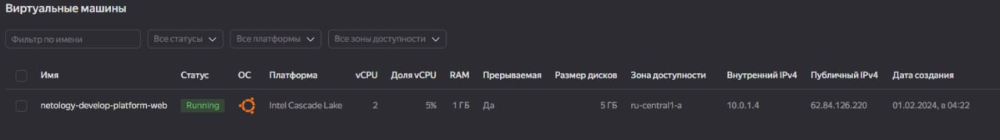

# Домашнее задание к занятию «Основы Terraform. Yandex Cloud»


## Задание 1

1. Изучите проект. В файле variables.tf объявлены переменные для Yandex provider.

2. Создайте сервисный аккаунт и ключ. service_account_key_file.

3. Сгенерируйте новый или используйте свой текущий ssh-ключ.
Запишите его открытую(public) часть в переменную vms_ssh_public_root_key.

4. Инициализируйте проект, выполните код. Исправьте намеренно допущенные синтаксические ошибки.
Ищите внимательно, посимвольно. Ответьте, в чём заключается их суть.

[Платформы](https://cloud.yandex.com/en/docs/compute/concepts/performance-levels)

5. Подключитесь к консоли ВМ через ssh и выполните команду  curl ifconfig.me.
Примечание: К OS ubuntu "out of a box, те из коробки" необходимо подключаться под пользователем ubuntu: "ssh ubuntu@vm_ip_address". Предварительно убедитесь, что ваш ключ добавлен в ssh-агент: eval $(ssh-agent) && ssh-add Вы познакомитесь с тем как при создании ВМ создать своего пользователя в блоке metadata в следующей лекции.;

6. Ответьте, как в процессе обучения могут пригодиться параметры preemptible = true
и core_fraction=5 в параметрах ВМ.

В качестве решения приложите:
  * скриншот ЛК Yandex Cloud с созданной ВМ, где видно внешний ip-адрес;

  * скриншот консоли, curl должен отобразить тот же внешний ip-адрес;

  * Ответы на вопросы:

  Вопрос 4.  Ошибки.
    * Опечатка в платформе и указана несуществующая платформа. Заменил на standard-v2.
    * Указан неверный параметр cores для выбранной платформы. Поставил 2.

  Вопрос 6. Вопрос про preemptible.
Эти параметры могут применяться в процессе обучения для экономии ресурсов.
Параметр preemptible = true применяется для создания прерываемой ВМ,
которая предоставляется с существенной скидкой. Параметр core_fraction = 5 - это
гарантированная доля vCPU. Значение меньше 100 может использовать для задач
где не требуется гарантии производительности.


## Задание 2

1. Замените все хардкод-значения для ресурсов yandex_compute_image и yandex_compute_instance
на отдельные переменные. К названиям переменных ВМ добавьте в начало префикс vm_web_ . Пример: vm_web_name.
2. Объявите нужные переменные в файле variables.tf, обязательно указывайте тип переменной.
Заполните их default прежними значениями из main.tf.
3. Проверьте terraform plan. Изменений быть не должно.


### Задание 3

1. Создайте в корне проекта файл 'vms_platform.tf' . Перенесите в него все переменные первой ВМ.
2. Скопируйте блок ресурса и создайте с его помощью вторую ВМ в файле main.tf:
**"netology-develop-platform-db"** ,  ```cores  = 2, memory = 2, core_fraction = 20```.
Объявите её переменные с префиксом **vm_db_** в том же файле ('vms_platform.tf').
ВМ должна работать в зоне "ru-central1-b"
3. Примените изменения.


### Задание 4

1. Объявите в файле outputs.tf **один** output , содержащий: instance_name, external_ip,
fqdn для каждой из ВМ в удобном лично для вас формате.
2. Примените изменения.

В качестве решения приложите вывод значений ip-адресов команды ```terraform output```.


### Задание 5

1. В файле locals.tf опишите в **одном** local-блоке имя каждой ВМ, используйте интерполяцию ${..} с НЕСКОЛЬКИМИ переменными по примеру из лекции.
2. Замените переменные внутри ресурса ВМ на созданные вами local-переменные.
3. Примените изменения.


### Задание 6

1. Вместо использования трёх переменных  ".._cores",".._memory",".._core_fraction" в блоке
resources {...}, объедините их в единую map-переменную **vms_resources** и  внутри неё конфиги обеих ВМ в виде вложенного map.

### Задание 7*

Изучите содержимое файла console.tf. Откройте terraform console, выполните следующие задания: 

1. Напишите, какой командой можно отобразить **второй** элемент списка test_list.

Ответ: Команда `local.test_list[1]`, результат "staging"

2. Найдите длину списка test_list с помощью функции length(<имя переменной>).

Ответ: Команда`length(local.test_list)`, результат 3

3. Напишите, какой командой можно отобразить значение ключа admin из map test_map.

Ответ: keys(local.test_map)[0], Ответ "admin". Если я правильно понял что делать. 

4. Напишите interpolation-выражение, результатом которого будет: "John is admin for production server based on OS ubuntu-20-04 with X vcpu, Y ram and Z virtual disks", используйте данные из переменных test_list, test_map, servers и функцию length() для подстановки значений.

Ответ: "${local.test_map.admin} is admin for ${local.test_list[2]} server based on OS ${local.servers.production.image} with ${local.servers.production.cpu} vcpu, ${local.servers.production.ram} ram and ${length(local.servers.production.disks)} virtual disks"

**Примечание**: если не догадаетесь как вычленить слово "admin", погуглите: "terraform get keys of map"

В качестве решения предоставьте необходимые команды и их вывод.


